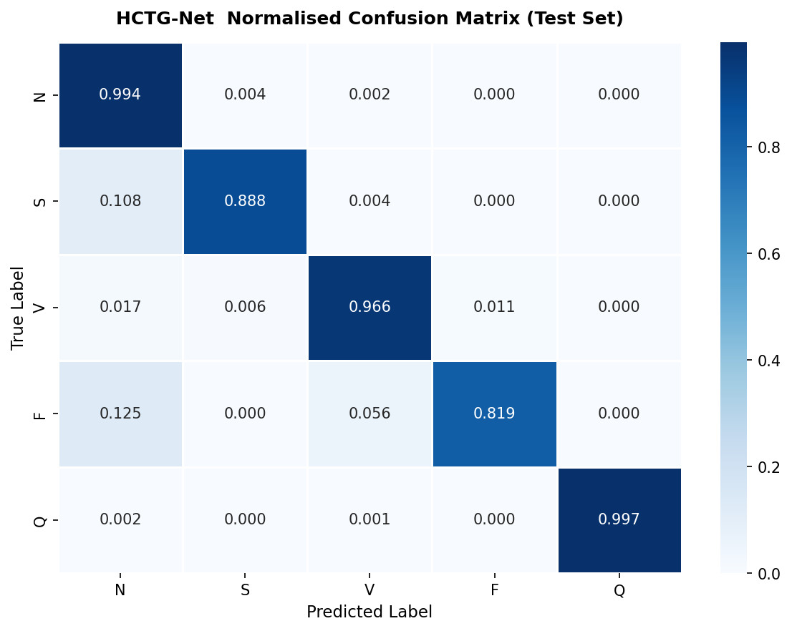

# HCTG-Net: Trustworthy ECG Arrhythmia Diagnosis

## Overview
A complete implementation of HCTG-Net — a Hybrid CNN-Transformer Network 
with Gated Fusion for automatic ECG arrhythmia classification.

## Results

| Dataset | Accuracy | Macro F1 | Macro AUC |
|---------|----------|----------|-----------|
| MIT-BIH | 98.82%   | 93.61%   | 0.9869    |
| PTB-XL  | 92.62%   | 83.71%   | 0.9798    |

### Cross-Validation (5-Fold)
- Macro F1: 91.71% +/- 0.93%
- Accuracy: 98.36% +/- 0.24%

### Model Calibration
- ECE before scaling: 0.0084 (Excellent)
- ECE after temperature scaling: 0.0031 (Excellent)

## Architecture
HCTG-Net combines three components:
- **CNN Branch**: Residual blocks (64->128->256) for local morphology
- **Transformer Branch**: 2-layer encoder for global temporal context
- **Gated Fusion Module**: Per-dimension adaptive weighting

## Project Structure
HCTG-Net/
├── preprocessing.py      # MIT-BIH data pipeline + SMOTE + augmentation
├── model.py              # HCTG-Net architecture
├── train.py              # Training loop + checkpointing
├── app.py                # Streamlit clinical dashboard
├── gradcam.py            # GradCAM explainability
├── cross_validate.py     # 5-fold cross validation
├── roc_auc.py            # ROC curves + AUC scores
├── ablation.py           # Ablation study
├── baselines.py          # Baseline model comparison
├── calibration.py        # Temperature scaling calibration
├── statistical_tests.py  # McNemar + Wilcoxon tests
├── ptbxl_pipeline.py     # PTB-XL dataset pipeline
└── results/              # All figures and reports

## Installation
`ash
pip install torch torchvision wfdb scikit-learn imbalanced-learn
pip install matplotlib seaborn streamlit grad-cam statsmodels pandas
`

## Usage

### Train on MIT-BIH
`ash
python train.py
`

### Train on PTB-XL
`ash
python ptbxl_pipeline.py
`

### Run Clinical Dashboard
`ash
streamlit run app.py
`

### Generate GradCAM Explanations
`ash
python gradcam.py
`

### Run Full Evaluation Suite
`ash
python cross_validate.py
python roc_auc.py
python ablation.py
python baselines.py
python calibration.py
python statistical_tests.py
`

## Dataset
MIT-BIH and PTB-XL are downloaded automatically from PhysioNet on first run.

## AAMI Classes
| Class | Description | Test F1 |
|-------|-------------|---------|
| N | Normal / Bundle Branch Block | 0.9939 |
| S | Supraventricular Ectopic | 0.8767 |
| V | Ventricular Ectopic (PVC) | 0.9648 |
| F | Fusion Beat | 0.8479 |
| Q | Paced / Unknown | 0.9975 |

## Reference
Based on:
> Xiong et al., HCTG-Net: A Hybrid CNN-Transformer Network with Gated Fusion
> for Automatic ECG Arrhythmia Diagnosis, Bioengineering 2025, 12, 1268.

## Acknowledgements
AI-assisted tools were used for language refinement and code development 
during the preparation of this manuscript.
